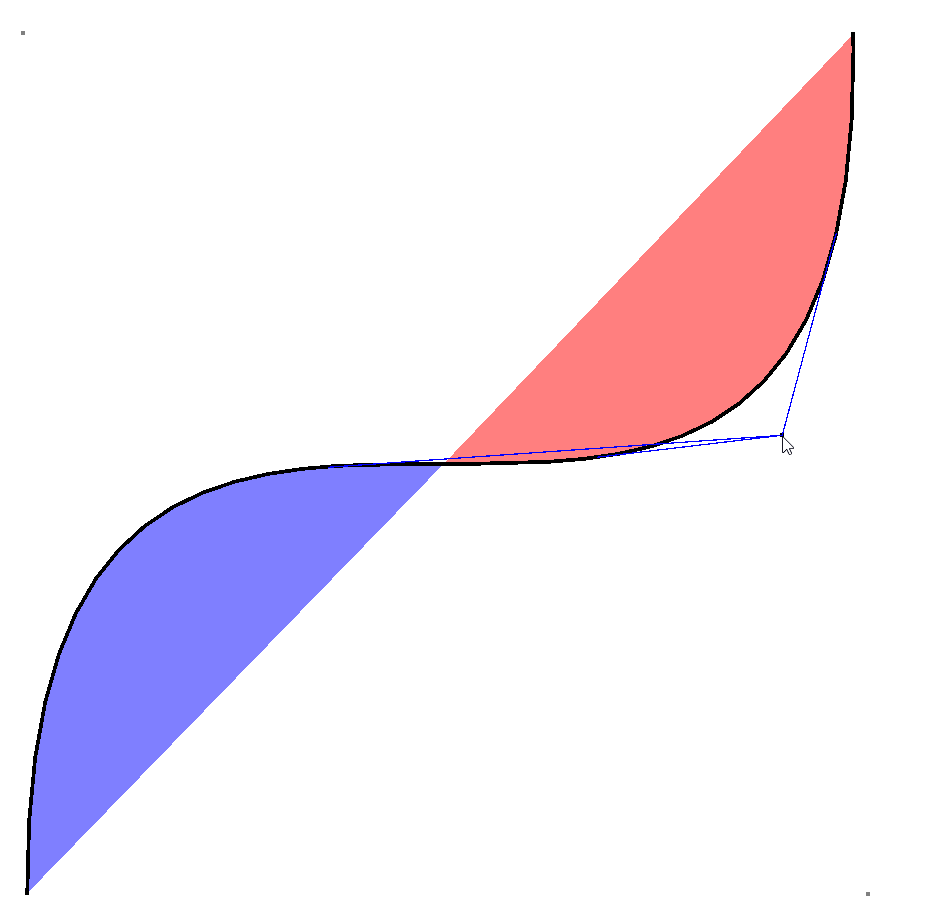

# About

This is a Bezier Curve tangent demonstration which may not look visually incredible, but is the baseline for something greater.

I recommend familiarizing yourself first with the concept of a [Bezier curve](https://en.wikipedia.org/wiki/B%C3%A9zier_curve) if you are not already. 
Another good link is [this page](https://pages.mtu.edu/~shene/COURSES/cs3621/NOTES/spline/Bezier/bezier-der.html) on the derivative of a n degree bezier curve.

# Purpose

For effective raycasting on curved surfaces (see [this project](https://github.com/andy98725/True-Movementhttps://github.com/andy98725/True-Movement)), I needed to find the tangents of Bezier curves which intersect some point.

My initial approach was to solve it mathematically. For degree 2 curves, the equation is a power 3 polynomial, which is reasonable. For degree n, it's a polynomial of power 2n-1; I am not writing a polynomial solver for this.

I implemented up to degree 3; The degree 3 curve uses a flattened approximation to figure out approximate tangents by brute force. This is not elegant, but it is fairly efficient, and should work well for higher degrees too.

# Mathematical approach

We have the equation of a n-degree Bezier curve, Bx(t) and By(t).
The derivatives are B'x(t) and B'y(t).
And we have a point (x, y).

We want the [0, n] possible equations tangent to the curve that intersect (x, y).

These may be computed through the observation (By(t) - y)/(Bx(t) - x) -= B'y(t)/B'x(t)
This results in a polynomial of degree 2n-1.

# Usage

Compile src/Main.java and run it. It should create a window.

With the application running, left click to place points for the Bezier curve.
Move the mouse around to view tangents to the curve. Right click or spacebar to clear the curve.

# Examples

